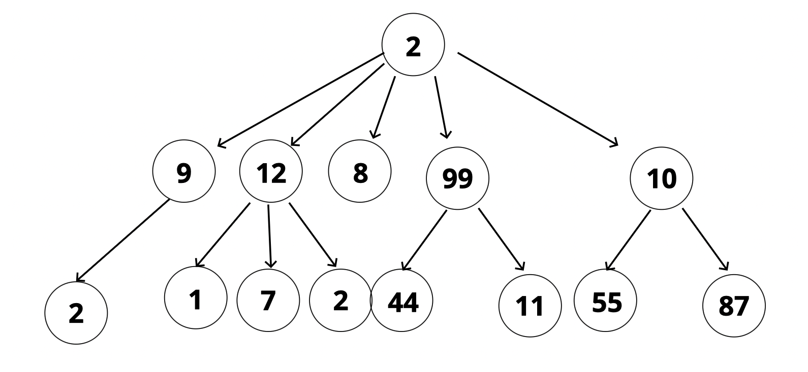

# Binary Search Trees

- [Binary Search Trees Slides](https://cs.slides.com/colt_steele/trees)

## Objectives

- Define what a tree is
- Compare and contrast trees and lists
- Explain the differences between trees, binary trees, and binary search trees (BST)
- Implement operations on binary search trees.

## What is a Tree?

- A data structure that consists of nodes in a **parent / child** relationship.

- Can store numbers or strings in a tree
- Lists: linear
  - only one path
- Trees - nonlinear
  - many different paths

---

- Singly Linked List: sort of a special case of a tree.

## Tree Terminology

|   Tree   |                                Description                                |
| :------: | :-----------------------------------------------------------------------: |
|   Root   |                          The top node in a tree.                          |
|  Child   | A node directly connected to another node when moving away from the Root. |
|  Parent  |                      The converse notion of a child.                      |
| Siblings |                  A group of nodes with the same parent.                   |
|   Leaf   |                         A node with no children.                          |

