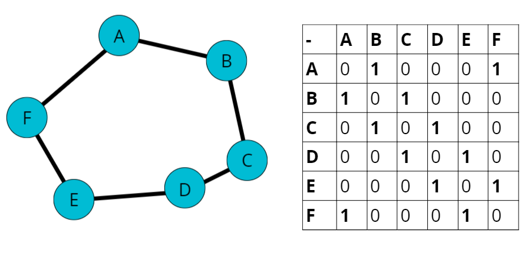
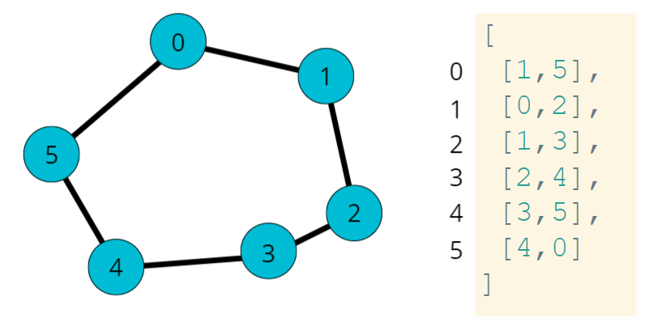
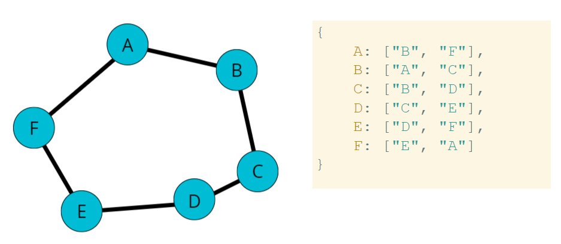
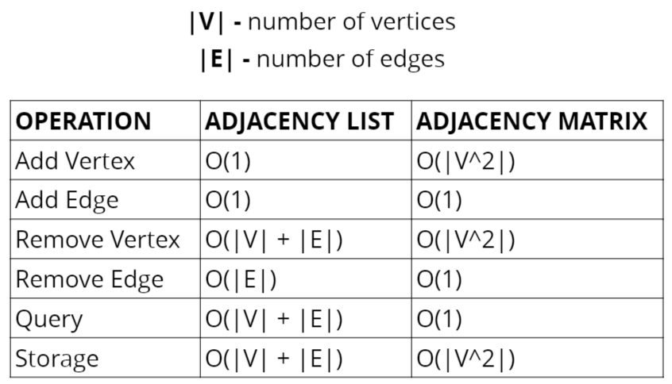

# Graphs

- [Graphs Slides](https://cs.slides.com/colt_steele/graphs)

## Objectives

- Explain what a graph is
- Compare and contrast different types of graphs and their use cases in the real world
- Implement a graph using an adjacency list.
- Traverse through a graph using BFS and DFS.
- Compare and contrast graph traversal algorithms.

## What are Graphs?

- A graph data structure consists of a finite (and possibly mutable) set of vertices or nodes or points, together with a set of unordered pairs of these vertices for an undirected graph or a set of ordered pairs for a directed graph.
- Nodes + Connections

## Uses for Graphs

- Social Networks
- Location / Mapping
- Routing Algorithms
- Visual Hierarchy
- File System Optimizations
- Recommendations
    - "People also watched"
    - "You might also like"
    - "People you might know"
    - "Frequently bought with"

## Types of Graphs

- Vertex: a node
- Edge: connection between nodes
- Weighted / Unweighted: values assigned to distances between vertices.
    - unweighted: no values in edges
    - weighted: values in edges (maps)
- Directed / Undirected: directions assigned to distances between vertices.
    - Undirected: Facebook friend (can view each others profile)
    - Directed: Instagram Followers (if don't follow back then cannot see profile.)

## Storing Graphs: Adjacency Matrix

- `0` no connection, `1` connection



## Adjacency List

- Adjacency list for numbers



- Use hash table for strings



## Adjacency Matrix vs List Big O



## Adjacency List vs Adjacency Matrix

|Adjacency List|Adjacency Matrix|
|:-:|:-:|
|Can take up less space (in sparse graphs)|Takes up more space (in sparse graphs)|
|Faster to iterate over all edges|Slower to iterate oer all edges|
|Can be slower to lookup specific edge|Faster to lookup specific edge|

- Adjacency List will be the focus here
    - Most data in the real world tends to lend itself to sparsed and/or larger graphs.

## Graph Class

```js
class Graph {
    constructor() {
        this.adjacencyList = {}
    }
}
```

## Adding a Vertex

- Write a method called `addVertex`, which accepts the name of a vertex.
- It should add a key to the adjacency list with the name of the vertex and set its value to be an empty array.

```
g.addVertex("Tokyo")

{
    "Tokyo": []
}
```


