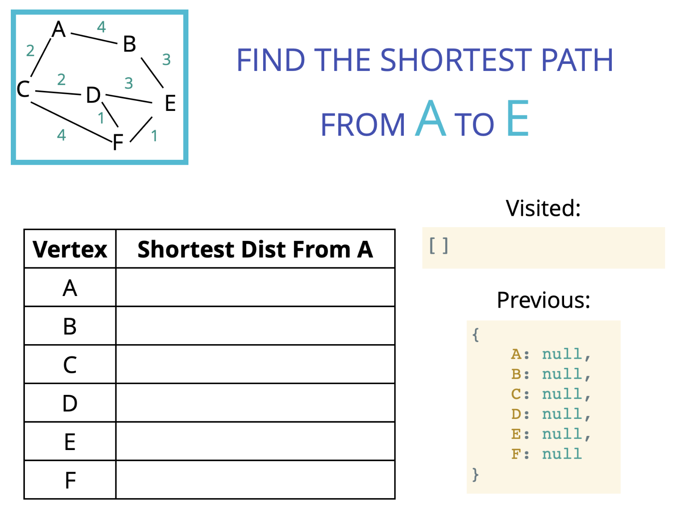

# Dijkstra's Algorithm

- Uses Graph and Priority Queue (Binary Heap)
- [Dijkstra's Algorithm Slides](https://cs.slides.com/colt_steele/graphs#/70)

## Objectives

- Understand the importance of Dijkstra's
- Implement a **Weighted Graph**
- Walk through the steps of Dijkstra's
- Implement Dijkstra's using a naive priority queue.
- Implement Dijkstra's using a binary heap priority queue.

## What is Dijkstra's Algorithm?

- Finds the shortest path between 2 vertices on a graph
- "What's the fastest way to get from point A to point B?"

## Why is it useful?

- GPS: finding fastest route
- Network routing: finds open shortest path for data
  - break up messages into a pieces.
- Biology: used to model the spread of viruses among humans
- Airline tickets: finding cheapest route to your destination

## Writing a Weighted Graph

```js
{
    "A": [{node: "B", weight: 10}]
}
```

## Dijkstra's Algorithm Approach

1. Every time we look to visit a new node, we pick the node with the smallest known distance to visit first.
2. Once we've moved to the node we're going to visit, we look at each of its neighbors.
3. For each neighboring node, we calculate the distance by summing the total edges that lead to the node we're checking from the starting node.
4. If the new total distance to a node is less than the previous total, we store the new shorter distance for that node.



## Priority Queue

- This priority queue uses the JavaScript sort
  - This gives **time complexity** of O(N log N)

```js
class PriorityQueue {
  constructor() {
    this.values = [];
  }

  enqueue(val, priority) {
    this.values.push({ val, priority });
    this.sort();
  }

  dequeue() {
    return this.values.shift();
  }

  sort() {
    this.values.sort((a, b) => a.priority - b.priority);
  }
}
```
