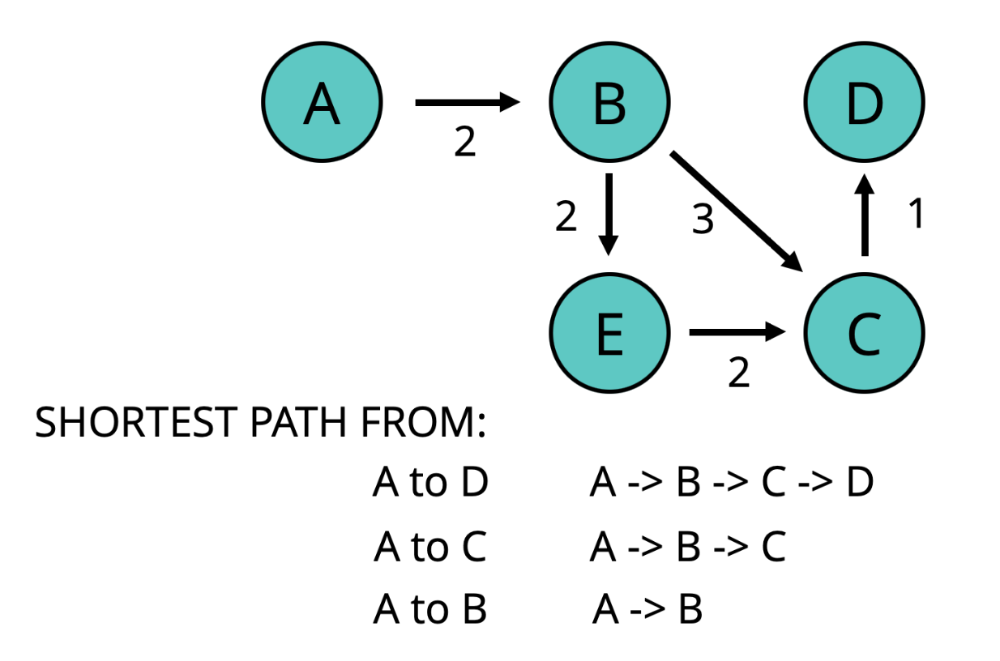
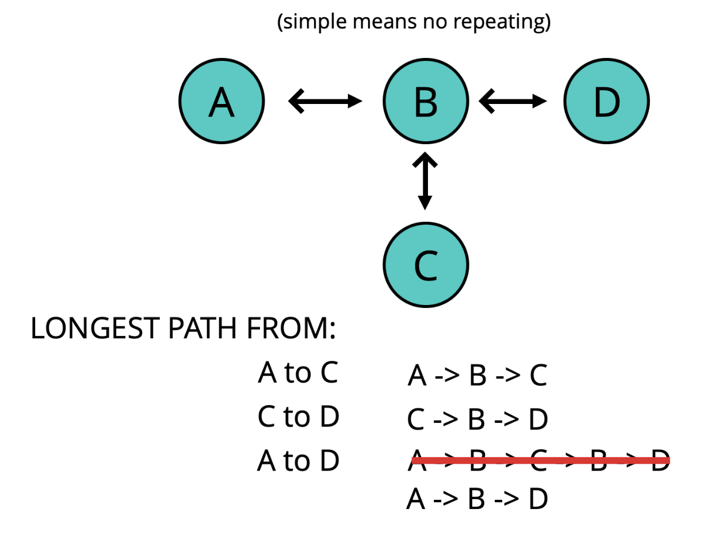

# Dynamic Programming

- [Dynamic Programming Slides](https://cs.slides.com/colt_steele/dynamic-programming)

## Objectives

- Define what dynamic programming is
- Explain what overlapping subproblems are
- Understand what optimal substructure is
- Solve more challenging problems using dynamic programming

## What is dynamic programming?

- A method for solving a complex problem by breaking it down into a collection of simpler subproblems, solving each of those subproblems just once, and storing their solutions.
- Improve performance.

## Overlapping Subproblems

- In dynamic programming, we look for overlapping subproblems.
- A problem is said to have overlapping subproblems if it can be broken down into subproblems which are reused several times.
- E.g., Fibonacci Sequence
    - Every number after the first two is the sum of the two preceding ones.
    - In the Fibonacci Sequence example below, calculation of `fib(3)` was repeated twice.


## Overlapping Subproblems in Merge Sort
- Merge Sort with no overlapping subproblems.
    - mergeSort([10, 24, 80, 68])
- Merge Sort with overlapping subproblems.
    - mergeSort([10, 24, 10, 24])
    - mergeSort([10, 24]) and mergeSort([10, 24])
        - solving the same subproblems, duplication!
    
## Optimal Substructure

- A problem is said to have optimal substructure if an optimal solution can be constructed from optimal solutions of its subproblems.
- With Optimal Substructure

- Without Optimal Substructure


## Recursive Fibonacci Sequence and it's Big O

```js
function fibonacci(n) {
    if (n <= 2) {
        return 1
    }
    return fibonacci(n - 1) + fibonacci(n-2)
}
```

- Time Complexity (2^N)
    - Exponential (BAD)
    - Worse than O(N^2)

## Memoization

- Storing the results of expensive function calls (e.g., fib(5)) and returning the **cached result** when the same inputs occur again.

```js
// Recursive + Memorization

```

